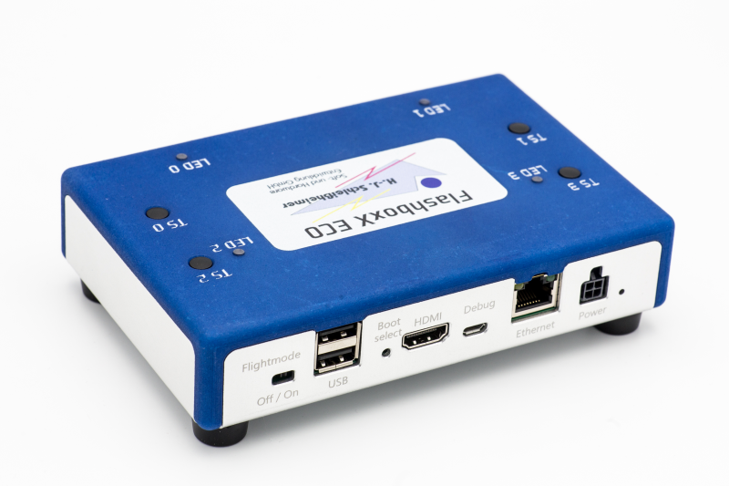
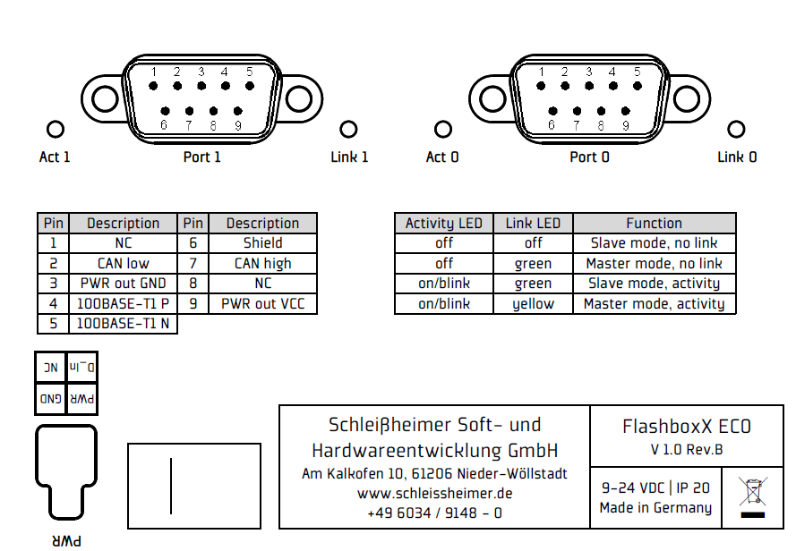

# Connect the Flashbox to the PC

By default the Flashbox uses DHCP on it's **Ethernet** Port to get it's ip.
If no DHCP Server is available it will fall back to 

`IP 192.168.8.10`

A common way is to connect a USB to Ethernet Adapter to your PC:

    PC <---> USB-ETH <---> Flashbox

Configure the USB ETH adatper with the IP `192.168.8.1`.
(See Ethernet settings -> Change adapter options)

Test the connection with `ping 192.168.8.10` from a console window.

# SSH Connection

    Username: pi
    Password: FlashboxX

# Get file access

## WinSCP
To get access to the flashbox files you can use the tool WinSCP.
Keep in mind that moving a file to Windows and back to Linux will remove the file attributes like executable (use chmod +x <file> to fix).
Also checking out a git repository should not be done on Windows.
This will also lead to invalid line endings and for example bash scripts will not run any more on Linux.

When opening a file via WinSCP it will copy it to a temp folder and open the file in VS Code. Saving the file will be detected by WinSCP and the file on the Flashbox gets updated.

## VS-Code
Another way to edit files is installing the extension Remote - SSH.

## Get root access
By default just the pi user is allowed to access via SSH.
Because of this you are not able to edit system files.

To activate root access via SSH follow the following steps:

    sudo nano /etc/ssh/sshd_config
    PermitRootLogin yes

    sudo passwd root
    sudo systemctl restart ssh

# LEDs / Flashprocess

After reboot LED 0 and LED 1 should blink magenta.
This indicates that a device can be connected.

Keep in mind that Power, CAN and ETH must be connected via SUB-D.

After ECU was connected press the button to start flashing.

    Button TS 0 => Port 0
    Button TS 1 => Port 1

The Flashbox sends tester present to detect the ECU.
When the flash process is running the LED is blinking cyan.

At the end the LED stays green if flashing was successful.
If there was an error the LED stays red.
If the ECU could not be detected the LED is blinking red.

LED|Description
-|-
Blinking magenta|Flashbox is ready, ECU can be connected. Press button to start to start flashing.
Blinking cyan|Flashing is in progress. Do not connect or disconnect the ECU because power is ON.
Blinking red|ECU could not be detected. Press button again to restart flashing.
Green|Flashing was successfull. Press button will switch into ready state. Press button again will start flashing next ECU.
Red|Flashing was not successfull. Press button will switch into ready state. Press button again will start flashing next ECU.

# Logs
All logs are located in the following folder:

    /var/log/flashboxx_env

File|Description
-|-
init.log|Contains init of network namespaces during startup.
flasher_&lt;port&gt;.log|Contains flasher output. After flashing the file gets copied with date and state info.
&lt;date&gt;&lt;port&gt;flasher&lt;state&gt;.log|Contains the flasher output. States are STOPPED, OK, or ERROR.
&lt;date&gt;&lt;port&gt;tcpdump&lt;state&gt;.pcap|Contains the tcp dump. 

# Pins

# Change startup

On reboot the following script is executed:
> /etc/init.d/flashbox.sh

This script runs as daemon/service.

To see outputs from flashbox service use:
> sudo journalctl -u flashbox.service -f

It starts the script flashenv_start.sh.
Stopping the service makes a cleanup via flashenv_stop.sh.

The script flashenv_start.sh is starting flashenv_do_flash.sh which runs in an endless loop.

To control the running flashbox service see:
Command|Description
-|-
sudo systemctl start flashbox.service|starts the flash service
sudo systemctl stop flashbox.service|stops the flash service
sudo systemctl restart flashbox.service|restarts the flash service
sudo systemctl status flashbox.service|status of the flash servicesudo systemctl daemon-reload|reloads services

# Help scripts
The following folder contains helper scripts
> /usr/local/bin

You can use for example fbx-switch-led-0.sh to change the LED.

Switch LEDs:

    /usr/local/bin/fbx-switch-led-0.sh off
    /usr/local/bin/fbx-switch-led-1.sh on

**Other helpfull commands**
Command|Description
-|-
tail -f flasher.log|shows tail of some logfile
ip a s|shows list of connected devices (CAN, ETH)
ip netns list|shows list of network namespaces
ps -x|shows active processes
ip netns exec port0|Executes a command within the network namespace port0
dmesg -w|Show kernel messages

# Update the flashbox

To update the flashbox you can use an USB stick (formated with Fat32) or a batch file.

The flashbox detects the connected USB stick and starts the script fbx-auto.sh.

You can modify this file to adjust the update process.

## Create backup
If you have created a working script environment on the flashbox you can use the script 
update/usb_backup.sh
to create a backup which gets copied on a connected usb stick.

Following folders are backed up into tar archive:
* /flashboxx_env/flashfiles
* /usr/local/bin
  
Connect the usb stick to another flashbox to install the same script environment. It sets all LEDs to green and waits for a key press to reboot the flashbox.

## Update flashfiles
One simple example you can find here:
update/usb_update/fbx-auto.sh

It copies a new flash file (pdx container) and the flash script to the flashbox. It sets all LEDs to green and waits for a key press to reboot the flashbox.

## Restore the flashbox
To restore the flashbox you can copy the content of following folder on the USB stick:
update/usb_restore

After a successfull update and button press it shutsdown the flashbox. You must do a power reset to restart the flashbox.

## Update via batch file

In addition to the USB update you can use a batch file to copy and execute scripts on the flashbox.

See example:
update\batch

The batch file UpdateFlashboxX.bat is using putty tools to copy the update folder to the flashbox tmp folder.
Then it executes the shell script UpdateFlashboxX.sh which replaces the flashfiles and updates the script environment.

# Network namespaces

The Flashbox has two ports (SUB-D connectors) which can be used to flash in parallel.
This requires to setup network namespaces in order to use the same IP address on both ports.

Example:
sudo ip netns add mynamespace

flashenv_start.sh creates the network namespaces
* port0
* port1

The flash script flashenv_doflash.sh is started within the context of the network namespace.

Example: sudo ip netns exec port0

